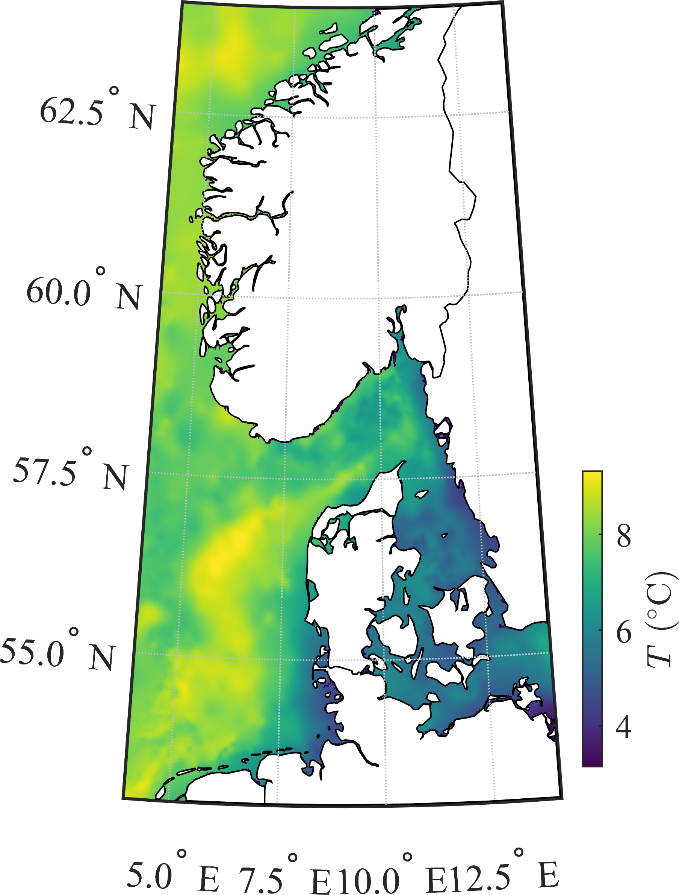

# Automated importation of sea surface temperature data
Matlab functions to import the high-resolution sea surface temperature data from the JPL OurOcean group

## Summary

The function getSST reads and store the sea surface temperature (SST)  produced daily by the JPL OurOcean group [1]. The dataset is described in more details in Chao et al. [2]. The SST data are available on a grid of 0.009 degree, which represents a horizontal resolution of approximatively  1 km. In the documentation, the second example uses the function borders.m and/or bordersm.m [3,4]. This is the first version of the submission, some bugs may still be present. Credits should go to [1,2] for the dataset.

## Content

The repository contains:
  - The function getSST, which read the netcdf files and extract the SST data, time and corresponding coordinates
  - An example within the Matlab livescript Documentation.mlx
  

## References
[1] https://podaac.jpl.nasa.gov/dataset/JPL_OUROCEAN-L4UHfnd-GLOB-G1SST

[2] Chao, Y., Z. Li, J. D. Farrara, and P. Huang: Blended sea surface  temperatures from multiple satellites and in-situ observations for  coastal oceans, 2009: Journal of Atmospheric and Oceanic Technology, 26  (7), 1435-1446, 10.1175/2009JTECHO592.1

[3]    Greene, Chad A., et al. “The Climate Data Toolbox for MATLAB.”  Geochemistry, Geophysics, Geosystems, American Geophysical Union (AGU),  July 2019, doi:10.1029/2019gc008392.

[4] https://se.mathworks.com/matlabcentral/fileexchange/50390-borders

## Example 1 (case of the North Sea) 

The fitting of the extended SEIR model to real data provides the following results:

